# Assignment 3 - Responsive Web Design

Name: Tolbasy Aliakbar 
Group: IT-2501

Theme: Volleyball

## Task 0 - Responsive Typography

In this task I created a simple volleyball page with a heading and paragraph.

I used media queries to change the font size on mobile, tablet and desktop.

Screenshots:

Mobile:

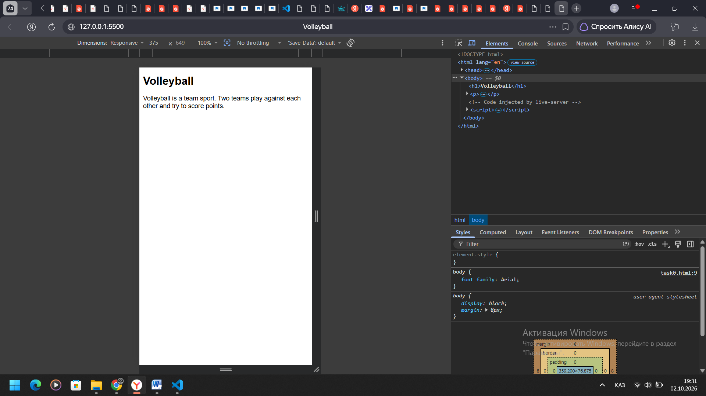

Tablet:

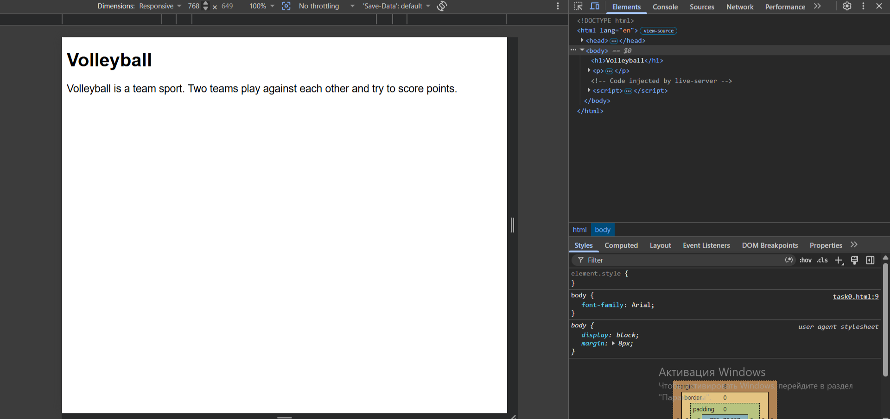

Desktop:

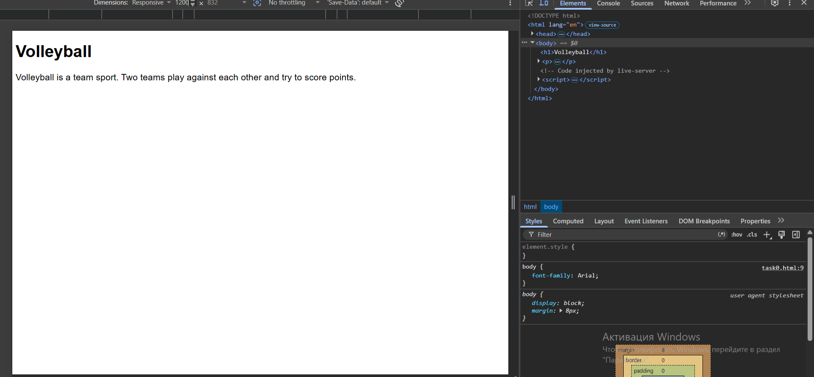

## Task 1 - Responsive Layout with Media Queries

In this task I created three volleyball position boxes.

On mobile the boxes are stacked vertically.

On tablet two boxes are shown in one row.

On desktop all three boxes are shown in one row.

Mobile:

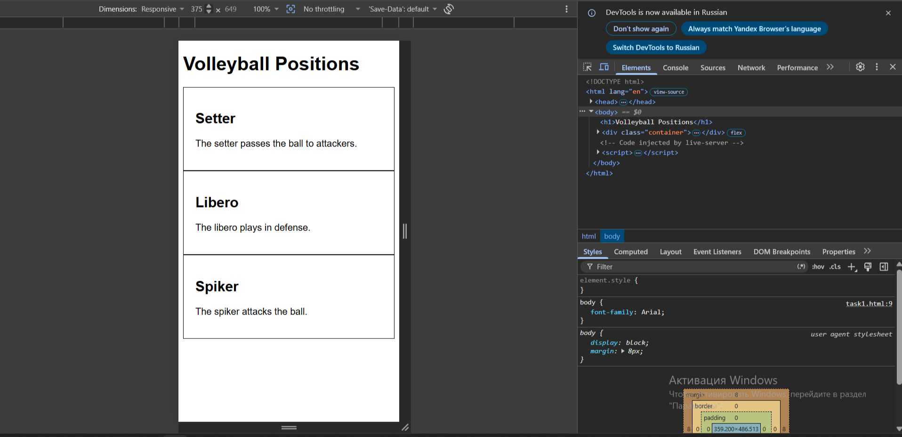

Tablet:

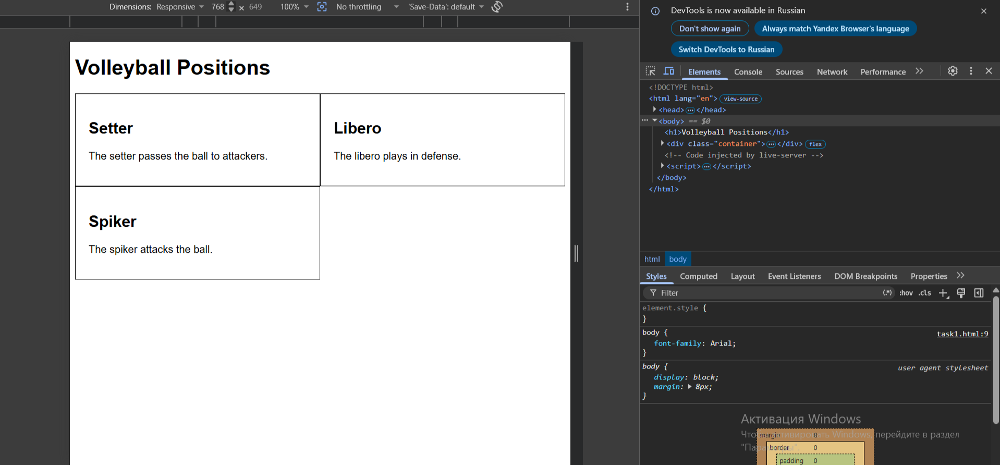

Desktop:

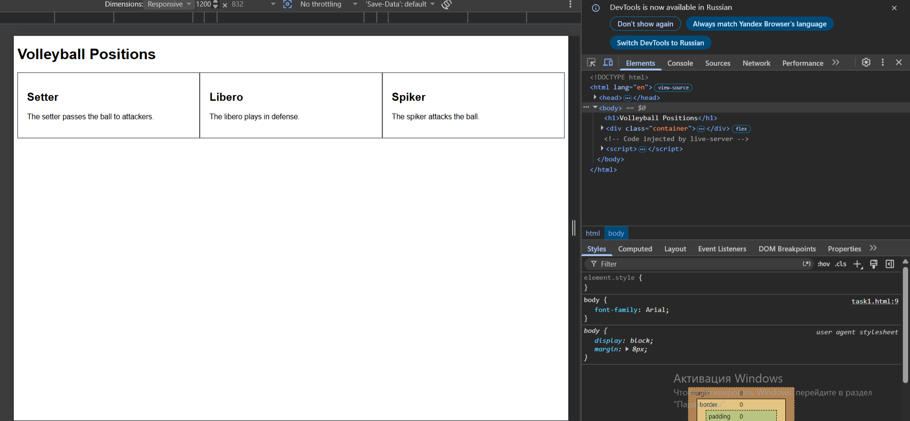

## Task 2 - Bootstrap Responsive Columns

In this task I used the Bootstrap 12-column grid system.

I used:

- col-12 for mobile
- col-md-6 for tablet
- col-lg-4 for desktop

Mobile:

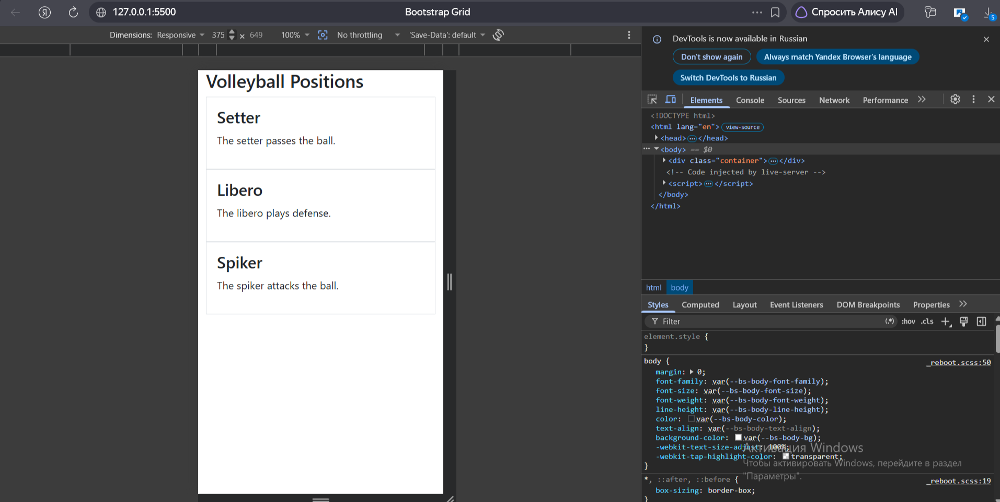

Tablet:

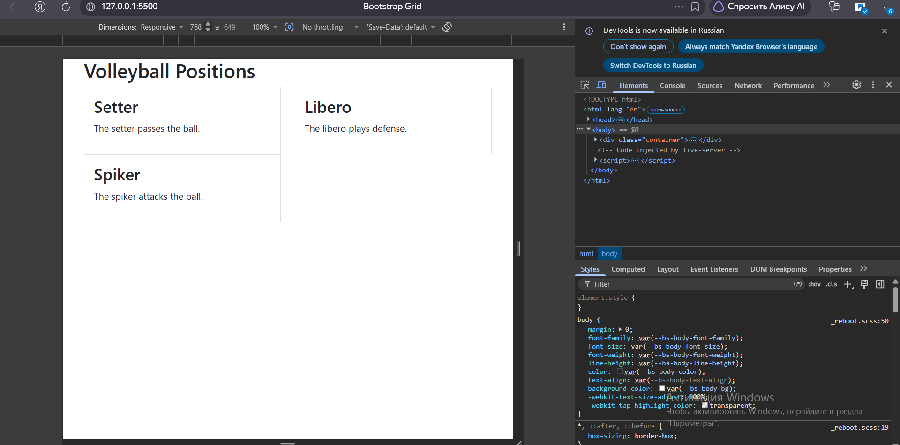

Desktop:

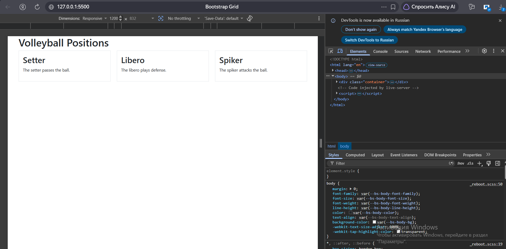

## Task 3 - Bootstrap Navigation Bar

In this task I created a responsive Bootstrap navigation bar.

The Volleyball logo is on the left.

The navigation links are on the right.

On a small screen the navigation changes to a hamburger menu.

Mobile:

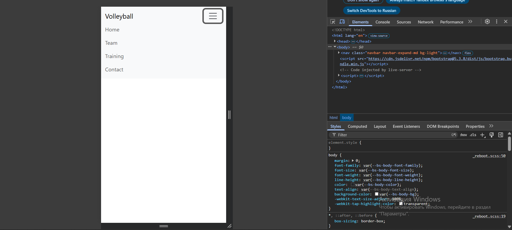

Desktop:

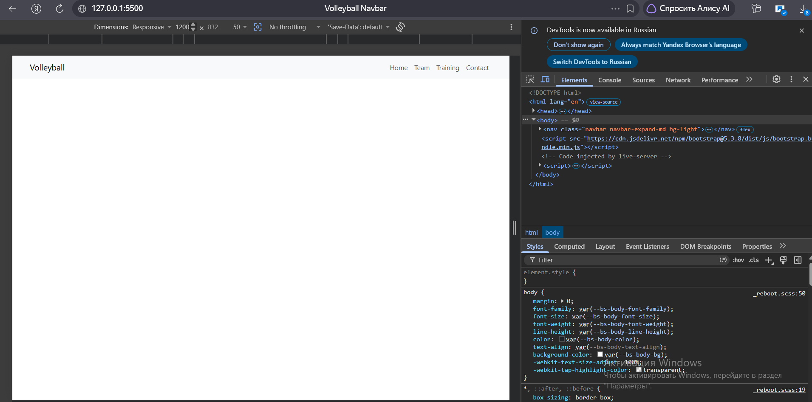

## Task 4 - Responsive Portfolio Page

In this task I created a responsive volleyball portfolio page.

The page contains:

- Bootstrap navbar
- Project cards
- Bootstrap grid
- Sidebar with personal information
- Footer
- CSS media queries

The layout changes for mobile, tablet and desktop.

Mobile:

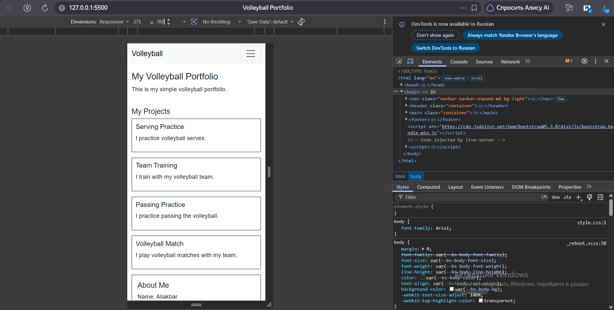

Tablet:

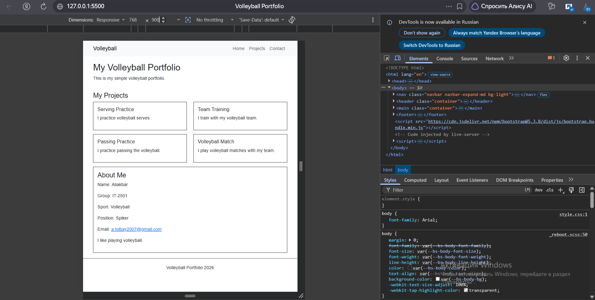

Desktop:

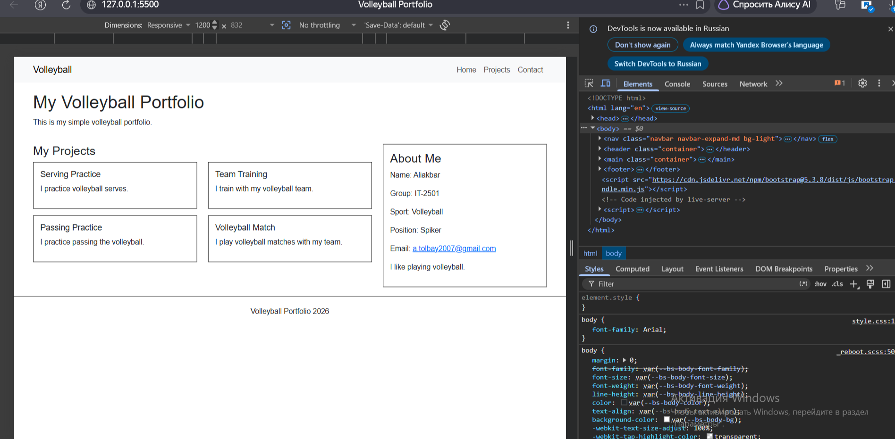

## Summary

In this assignment I learned how to use CSS Media Queries and Bootstrap.

I learned how to make webpages responsive for mobile, tablet and desktop.

I also learned how to use the Bootstrap Grid system and responsive navigation bar.